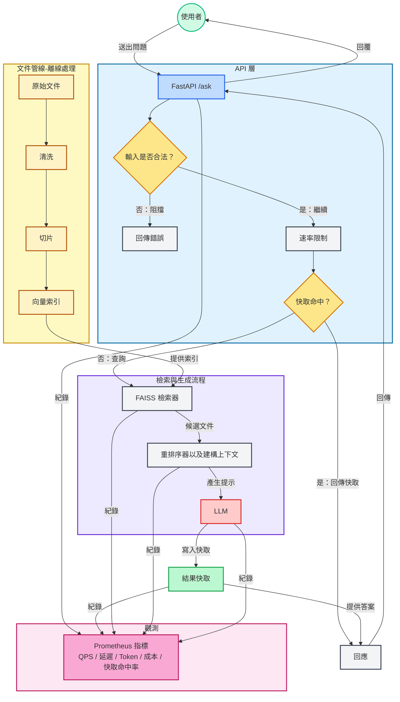

# Day27 - FAQ Bot (RAG + FAISS + OpenAI)

本專案為 2025 鐵人賽 Day27 的成果。
將前面實作的元件整合成一個可 Demo 的 FAQ Chatbot 雛型，具備以下能力：

- **API**：`/ask` 問答、`/healthz` 健康檢查、`/metrics` 指標
- **檢索**：FAISS 向量資料庫（持久化）
- **快取**：結果快取（記憶體，可換 Redis）
- **防護**：阻擋內網 URL、SQL Injection
- **觀測**：Prometheus 指標（請求數、延遲、Token 使用量、成本）

## 專案架構



## 專案結構

```yaml
./
├── backend/                        # 後端服務 (FastAPI + RAG pipeline)
│ ├── app/                          # 核心程式碼 (檢索、重排序、快取、防護、API)
│ ├── data/                         # 測試/開發用資料 (raw / clean / docs)
│ ├── benchmark/                    # 壓測腳本 (ab / locust)
│ └── tests/                        # 測試案例 (pytest)
├── frontend/                       # 前端靜態頁面 (index.html + JS + CSS)
├── observability/                  # 監控配置 (Prometheus + Grafana)
├── cloudflare_worker_api_proxy/    # Cloudflare Worker Proxy
├── ops/                            # 部署腳本
├── docker-compose.yml              # 本地開發編排
└── README.md                       # 專案說明文件
```

## 啟動方式

詳見各個子資料夾的 `README.md`。

### conda 小抄

```bash
conda env create -f environment.yaml
conda activate dayXX_XXX

# 停用環境
conda deactivate

# 查看所有環境
conda env list

# 刪除環境（⚠️ 慎用）
conda env remove -n dayXX_XXX

# 更新環境（當 environment.yml 有修改時）
conda env update -f environment.yml --prune
```
